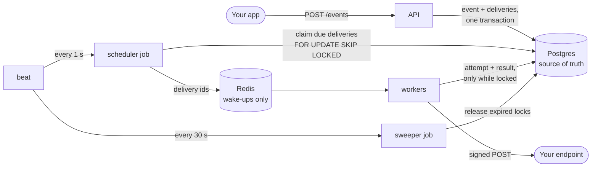

# Hookline


A webhook delivery service that doesn't lose events: each one is saved in Postgres before the
API answers, then signed, sent and retried, and kept as a dead letter to replay if all fail.

| [Chaos test](#chaos-test): workers killed mid-delivery | |
| --- | --- |
| Events sent | 10,001 |
| Workers killed with SIGKILL | 11 |
| Receiver failing on purpose | 20% of requests |
| **Events lost** | **0** |
| Duplicates | 2, caught by dedupe on `Hookline-Event-Id` |



## 60-second quickstart

Requires Docker. This starts Hookline with the bundled [mock receiver](#mock-receiver) and
sends it one event:

```bash
cp .env.example .env
docker compose --profile receiver up -d --build --wait

# Register the mock receiver and give it the signing secret, returned only this once
SECRET=$(curl -s -X POST localhost:8000/endpoints \
  -H "Authorization: Bearer hk_local_dev_key" -H "Content-Type: application/json" \
  -d '{"url": "http://receiver:9000/webhook", "event_types": ["order.shipped"]}' \
  | python3 -c 'import json, sys; print(json.load(sys.stdin)["secret"])')
curl -s -X PATCH localhost:9000/config -H "Content-Type: application/json" \
  -d "{\"secret\": \"$SECRET\"}"

# Send an event, then see it arrive
curl -s -X POST localhost:8000/events \
  -H "Authorization: Bearer hk_local_dev_key" -H "Content-Type: application/json" \
  -H "Idempotency-Key: quickstart-1" \
  -d '{"type": "order.shipped", "payload": {"order_id": 42}}'
sleep 2 && curl -s localhost:9000/stats   # "unique_events": 1
```

Then open the dashboard at http://localhost:8000/dashboard with the key `hk_local_dev_key`.
To run it on a server, see [docs/deploy.md](docs/deploy.md).

## Design decisions

- **Postgres is the source of truth.** An event and its deliveries are committed in one
  transaction before the API answers 202, and each delivery's state lives in its row. Redis
  only carries wake-ups, so a lost queue message or a Redis restart delays a delivery but
  can't drop it: the scheduler and sweeper find the work again in Postgres.
- **At-least-once delivery, not exactly-once.** A sender can't know whether a request that
  got no answer was processed, so resending is the only way never to lose an event.
  Receivers dedupe on `Hookline-Event-Id`; see [At-least-once delivery](#at-least-once-delivery).
- **`FOR UPDATE SKIP LOCKED` to claim work.** Several schedulers can claim due deliveries at
  once without taking the same row or waiting on each other, using the database already
  there instead of a separate lock service.
- **No delivery backlog for paused endpoints, and `recover` instead.** Events accepted while
  an endpoint is paused get no delivery for it, so a receiver that is gone for good doesn't
  pile up rows forever, and one that comes back isn't flooded on resume.
  `POST /endpoints/{id}/recover` creates the missing deliveries from the stored events when
  you are ready, and running it twice creates nothing new.

## Run locally

Requires Docker and [uv](https://docs.astral.sh/uv/).

```bash
cp .env.example .env
docker compose up --build
```

API docs: http://localhost:8000/docs
Dashboard: http://localhost:8000/dashboard
Health check: http://localhost:8000/health

Migrations run automatically: the `migrate` service applies `alembic upgrade head`
before the api, worker and beat start.

## API key

Every route except `/health` needs `Authorization: Bearer <api key>`. Hookline stores only
the key's SHA-256 hash, in `API_KEY_HASH`. The `.env.example` hash is for the local-only
key `hk_local_dev_key`. For any deployed environment, generate a new pair:

```bash
uv run python -m app.core.security
```

## Endpoints

Endpoint URLs must resolve only to public addresses. Private, loopback, link-local
(including `169.254.169.254`) and other internal addresses are rejected with 422, so
Hookline can't be pointed at internal services. With `DEBUG=true`, `localhost` is allowed
for local testing.

```bash
# Register an endpoint. The response includes its signing secret, shown only this once.
curl -X POST localhost:8000/endpoints \
  -H "Authorization: Bearer hk_local_dev_key" -H "Content-Type: application/json" \
  -d '{"url": "https://example.com/hook", "event_types": ["order.shipped"]}'

curl localhost:8000/endpoints -H "Authorization: Bearer hk_local_dev_key"

# Pause (or resume with true). See "Pausing, resuming and recovering" below.
curl -X PATCH localhost:8000/endpoints/<id> \
  -H "Authorization: Bearer hk_local_dev_key" -H "Content-Type: application/json" \
  -d '{"is_active": false}'

curl -X DELETE localhost:8000/endpoints/<id> -H "Authorization: Bearer hk_local_dev_key"
```

## Events

```bash
# 202 Accepted: the event and one pending delivery per subscribed, active endpoint are saved
# together. Resending the same Idempotency-Key returns the original event and creates nothing.
curl -X POST localhost:8000/events \
  -H "Authorization: Bearer hk_local_dev_key" -H "Content-Type: application/json" \
  -H "Idempotency-Key: order-42-shipped" \
  -d '{"type": "order.shipped", "payload": {"order_id": 42}}'

# "Did you send it?": the event, each delivery (endpoint, status) and every attempt
# (status code, response time, error, when), oldest first.
curl localhost:8000/events/<id> -H "Authorization: Bearer hk_local_dev_key"
```

Attempts from before a [replay](#dead-letters-and-replay) stay in the list, so a delivery can
show more attempts than its `attempt_count`, which counts only those since the last replay.

## Delivery

Every second, the `beat` service triggers a job that claims up to 100 due deliveries
(`pending`, `next_attempt_at` passed, endpoint active) with `FOR UPDATE SKIP LOCKED`.
It marks them `in_progress` for 60 seconds, commits, and only then queues them for the
workers. Several schedulers can run at once without claiming the same delivery. Deliveries
for a paused endpoint wait as `pending` until it's resumed.

A worker then POSTs the event's JSON payload to the endpoint (10-second timeout, redirects
not followed) with these headers:

| Header | Value |
| --- | --- |
| `Hookline-Event-Id` | The event's id. Dedupe on it: see [At-least-once delivery](#at-least-once-delivery). |
| `Hookline-Event-Type` | The event's type, e.g. `order.shipped` |
| `Hookline-Signature` | `t=<unix time>,v1=<hex HMAC-SHA256>`, see [Verifying signatures](#verifying-signatures) |

Every try is logged in `delivery_attempts` with its status code, time taken and error. A
2xx marks the delivery `succeeded`.

### Retries

A timeout, connection error, DNS failure, 5xx or 429 is retried with backoff. The delivery
goes back to `pending` with a later `next_attempt_at`, and the scheduler picks it up again
then:

| Attempt | 1 | 2 | 3 | 4 | 5 |
| --- | --- | --- | --- | --- | --- |
| Wait before the next try | 10 s | 1 min | 5 min | 30 min | `dead` |

Each wait gets ±20% random jitter, so deliveries that failed together don't all retry in the
same second. Any other response (3xx, other 4xx) means the request itself is wrong, so the
delivery is marked `dead` straight away, as is an endpoint that now resolves to an internal
address. Each retry is signed again with its own timestamp.

The endpoint's host is resolved and checked again at send time, and the worker connects to
exactly the address it checked. A name that has since started pointing at an internal
address (DNS rebinding) is blocked.

Celery tasks are acknowledged only after they finish (`acks_late`) and requeued if a
worker process dies mid-task.

### Dead letters and replay

A `dead` delivery stays in the database with every attempt logged. List them with the
last attempt's status code and error, then send them again once the receiver is fixed:

```bash
# Newest first. Filter by status and/or endpoint_id; limit defaults to 100 (max 500).
# X-Total-Count gives the number of matches; while more remain, pass X-Next-Cursor
# back as ?cursor= for the next page.
curl -i "localhost:8000/deliveries?status=dead" -H "Authorization: Bearer hk_local_dev_key"

# Replay one: back to pending, due now, with a fresh 5 attempts.
curl -X POST localhost:8000/deliveries/<id>/replay -H "Authorization: Bearer hk_local_dev_key"

# Replay every dead delivery of one endpoint, e.g. after its outage. Returns {"replayed": n}.
curl -X POST localhost:8000/endpoints/<id>/replay-dead -H "Authorization: Bearer hk_local_dev_key"
```

Replay sets `attempt_count` back to 0 and keeps the old attempts in the log. Only `dead`
deliveries can be replayed; any other status gets a 409. The check and the reset are one
conditional `UPDATE`, so a delivery a worker is sending is never touched and a double-click
replays once. Replayed deliveries of a paused endpoint wait as `pending` until it's resumed.
The receiver gets the same `Hookline-Event-Id` again, so its dedupe still applies.

### Auto-pause

An endpoint that fails every attempt for 24 hours is paused automatically, so workers stop
spending time on it. The first failed attempt after a success sets the endpoint's
`failing_since`, and the next success clears it. Once a minute a beat job pauses every
active endpoint whose `failing_since` is 24 hours old (`is_active = false`, `auto_paused_at`
set) and logs a warning. Both fields are in `GET /endpoints`, and the dashboard shows the
endpoint as "failing" (with the time it will be paused) and then "auto-paused".

Resuming clears `failing_since` and `auto_paused_at`, so the endpoint gets a fresh 24 hours.

### Pausing, resuming and recovering

Pausing an endpoint, by hand or automatically, sets its `paused_at`. What happens to its
events:

- **Deliveries it already has** wait as `pending` and go out when it's resumed. Its dead
  ones stay dead until replayed.
- **Events accepted while it's paused** get no delivery for it, so nothing piles up for a
  receiver that may be gone for good. The events themselves are stored like any other.

Resuming does **not** send the events from the pause: a receiver that has just come back
may not want a flood. The resume response includes `recover_since`; pass it to `recover`
when you're ready (you can also recover while still paused, without `since`):

```bash
curl -X PATCH localhost:8000/endpoints/<id> \
  -H "Authorization: Bearer hk_local_dev_key" -H "Content-Type: application/json" \
  -d '{"is_active": true}'
# → {..., "is_active": true, "paused_at": null, "recover_since": "2026-09-29T09:37:07Z"}

# Pending deliveries for every event of a subscribed type created since then that has none
# for this endpoint. Returns {"created": n, "since": ...}.
curl -X POST "localhost:8000/endpoints/<id>/recover?since=2026-09-29T09:37:07Z" \
  -H "Authorization: Bearer hk_local_dev_key"
```

- `since` needs a time zone. Without it, recover uses the endpoint's `paused_at`, so it only
  works while the endpoint is still paused; otherwise it's a 422. Endpoints paused by hand
  before `paused_at` existed also need an explicit `since`.
- The default window, and `recover_since`, starts one minute before `paused_at`, but never
  before the endpoint was created. That catches an event accepted in a transaction that
  began just before the pause, whose fan-out ran just after it.
- Running recover again creates nothing new. Each delivery is unique per (event, endpoint),
  and the insert is `ON CONFLICT DO NOTHING`, so a concurrent recover or fan-out can't
  duplicate one either.
- Deliveries are inserted and committed 1,000 at a time, so a long pause doesn't become one
  huge transaction. If recover fails partway, run it again: it picks up the rest.

### Recovering stuck deliveries

If a worker dies mid-send, or a queued task is lost, its delivery would stay `in_progress`
forever. Every 30 seconds a sweeper job sets `in_progress` deliveries whose 60-second lock
has expired back to `pending`, and the scheduler claims them again on its next tick.
Postgres, not Redis, is what guarantees the work gets done.

A worker saves its result only if it still holds the delivery: the row must still be
`in_progress` with the same `locked_until` its claim set (every claim sets a new one). If a
slow request outlived the lock and the delivery has since been released, claimed by another
worker or settled, that update changes 0 rows and the stale result is dropped, so it never
overwrites the current owner's. A lock that expired with nobody taking over still counts.

### Graceful shutdown

`docker stop` sends SIGTERM, which starts Celery's warm shutdown: the worker finishes the
requests it is sending, puts the messages it had prefetched back on the queue, takes no new
work, and exits. The worker's `stop_grace_period` is 60 seconds, as long as a delivery lock.
Docker's default of 10 seconds before SIGKILL could cut short a send that is still within
its timeouts (connecting, writing and reading each get 10 seconds).

A worker killed outright (`kill -9`, out of memory, a lost machine) loses nothing either. Its
delivery stays `in_progress` until the lock runs out, then the sweeper releases it and it is
sent again: up to 60 seconds for the lock plus up to 30 until the next sweep. To try it, kill
the worker while it is sending, then start it again:

```bash
docker compose kill -s SIGKILL worker
docker compose start worker
```

## Dashboard

http://localhost:8000/dashboard shows the endpoints with their success rate, the
dead-letter list with each delivery's last error and a Replay button, and recent events.
Click an event id to see every delivery and attempt. It refreshes every 10 seconds. Dead
letters load 100 at a time ("Load more"), and each endpoint's "Replay all N dead" names the
full count it will replay, old deliveries included, and asks before doing it. Paused
endpoints get a Resume button.

It's a static page (`app/dashboard/`) that calls the JSON API. The API key you enter is
kept only in the page's memory: not in `sessionStorage`, `localStorage` or a cookie, so no
other page can read it and reloading asks for it again (a password manager can fill it in).
It goes out as a Bearer header, which, unlike a cookie, a browser never adds by itself, so
another site can't trigger a replay through your browser. The page is served with a strict
Content-Security-Policy, and API data is only ever inserted as text, since error bodies
come from receivers.

It uses two routes you can call directly as well:

```bash
# Recent events, newest first, with delivery counts by status (limit defaults to 50, max 200)
curl "localhost:8000/events?limit=20" -H "Authorization: Bearer hk_local_dev_key"

# Per endpoint, deliveries created in the last 24 hours by status,
# success_rate = succeeded / (succeeded + dead) (null until one has finished), and
# dead_total: every dead delivery of any age, i.e. what replay-dead would replay.
curl localhost:8000/endpoints/stats -H "Authorization: Bearer hk_local_dev_key"
```

## At-least-once delivery

Hookline delivers every event **at least once**, not exactly once. Your receiver can get the
same event more than once:

- A worker dies after your receiver got the request but before Hookline saved the result.
  The sweeper hands the delivery back and it is sent again.
- Your receiver handles the request but answers after the 10-second timeout, or the response
  is lost on the way back. Hookline sees a failure and retries.
- A worker holds a delivery past its 60-second lock (a backed-up queue, say), and the sweeper
  gives it to another worker.

No webhook sender can avoid this. Hookline can't know whether a request it never got an
answer to was processed, and resending is the only way not to lose the event. Stripe,
GitHub and Shopify webhooks work the same way.

**Dedupe on `Hookline-Event-Id`.** It is the same on every retry and resend of an event (the
signature is not: each try is signed with its own timestamp). Record the ids you have
processed in the same transaction as the work itself, so a crash rolls back both:

```python
# processed_events.event_id is the primary key.
with db.begin():
    first_time = db.execute(
        text("INSERT INTO processed_events (event_id) VALUES (:id) ON CONFLICT DO NOTHING"),
        {"id": request.headers["Hookline-Event-Id"]},
    ).rowcount
    if first_time:
        handle(event)
```

Answer a duplicate with 2xx too, or Hookline keeps retrying it. The id belongs to the
event, so an event sent to several of your endpoints has the same id at each; if one
receiver serves several endpoints, dedupe per endpoint. Keep responses under 10 seconds:
queue slow work and answer right away.

## Verifying signatures

Each request is signed with the endpoint's secret (the `whsec_...` value returned when the
endpoint was created):

```
Hookline-Signature: t=1727600000,v1=5f2c...
v1 = hex(HMAC_SHA256(secret, f"{t}.{raw_body}"))
```

`t` is the time of that try, so every retry carries a fresh signature. Recompute the HMAC
over the **raw** request body (parsing and re-serialising the JSON changes the bytes), and
reject requests whose `t` is more than 5 minutes away from your clock. That stops a captured
request from being replayed later. Copy this into your receiver (Python standard library
only):

<!-- verify_signature: tests/test_signing.py runs this exact code -->
```python
import hashlib
import hmac
import time


def verify_signature(secret: str, body: bytes, header: str, tolerance: int = 300) -> bool:
    """Check a Hookline-Signature header against the raw request body."""
    timestamp = None
    signatures = []
    for part in header.split(","):
        key, _, value = part.strip().partition("=")
        if key == "t" and value.isdigit():
            timestamp = int(value)
        elif key == "v1":
            signatures.append(value)
    if timestamp is None or not signatures:
        return False
    if abs(time.time() - timestamp) > tolerance:
        return False
    message = f"{timestamp}.".encode() + body
    expected = hmac.new(secret.encode(), message, hashlib.sha256).hexdigest()
    return any(hmac.compare_digest(expected, signature) for signature in signatures)
```

For example, in FastAPI:

```python
@app.post("/hook")
async def hook(request: Request):
    body = await request.body()
    if not verify_signature(WEBHOOK_SECRET, body, request.headers.get("Hookline-Signature", "")):
        raise HTTPException(status_code=401)
    event = json.loads(body)
    ...
```

## Migrations

Run Alembic inside a container, where `DATABASE_URL` points at the `postgres` service:

```bash
# After changing models in app/models/
docker compose run --rm api alembic revision --autogenerate -m "describe the change"
docker compose run --rm api alembic upgrade head
docker compose run --rm api alembic current
```

New migration files land in `alembic/versions/`. Format and review them before committing:

```bash
uv run ruff format alembic/versions && uv run ruff check alembic/versions
```

## Mock receiver

A webhook receiver for load and chaos tests, in [receiver/](receiver/). It verifies each
request's signature, records every `Hookline-Event-Id`, and can be told to fail a share of
requests (with a 500, which Hookline retries) or to answer slowly. A test tool: its control
routes have no auth, so compose publishes it on `127.0.0.1` only. Never expose it.

```bash
docker compose up -d receiver
```

Its address, `http://receiver:9000/webhook`, is private, so workers reach it only because
`.env` lists `receiver:9000` in `ALLOWED_INTERNAL_HOSTS` (see `.env.example`). An entry is
`host:port`, or `host` for any port; its addresses aren't checked, so list only names your
own DNS answers for, like compose service names. Register it, then give it the secret
Hookline returned:

```bash
curl -s -X POST localhost:8000/endpoints -H "Authorization: Bearer $KEY" \
  -H "Content-Type: application/json" \
  -d '{"url": "http://receiver:9000/webhook", "event_types": ["order.shipped"]}'

curl -s -X PATCH localhost:9000/config -H "Content-Type: application/json" \
  -d '{"secret": "whsec_...", "fail_percent": 20, "delay_ms": 0}'
```

| Route | |
| --- | --- |
| `POST /webhook` | 401 on a bad or old signature, else waits `delay_ms`, then 500 for `fail_percent`% of requests, 204 for the rest |
| `GET` / `PATCH /config` | `secret`, `fail_percent` (0–100), `delay_ms` (0–60000); also `RECEIVER_*` env vars at start |
| `GET /stats` | Requests, rejected, failed, delivered, unique events, duplicates |
| `GET /received` | Every event id: when it first arrived, attempts, 2xx answers |
| `DELETE /received` | Forget what was received; the config stays |

`/webhook` is the only POST route: Hookline delivers with POST, so an endpoint aimed at any
other path can't change the config or records. State is in memory in one process, so run a
single uvicorn worker.

## Load test

[scripts/load_test.py](scripts/load_test.py) finds the highest event rate at which p95
latency stays under one second. Latency is per event: from when Hookline accepted it
(`events.created_at`) to when its first delivery attempt reached the
[mock receiver](#mock-receiver). For each rate, [k6](loadtest/events.js) sends events at that
rate, the script waits until every accepted event has arrived, then measures. It stops at
the first rate that misses; a rate also misses if k6 couldn't hold it, a request wasn't
accepted, or an event never arrived.

```bash
docker compose up -d && docker compose up -d receiver
uv run python scripts/load_test.py --rates 50,100,200,400 --duration 30s
```

k6 runs from the `grafana/k6` image, so nothing needs installing. `--all` runs every rate
even after a miss. To test another API, pass both `--api-url` (as this script reaches it)
and `--k6-api-url` (as the k6 container does). Results are also saved to `loadtest/results/`. The events stay in the
database; the endpoint and receiver state are cleaned up.

### Results

Measured 2026-09-29 on a laptop (Intel i5-7300U, 2 cores / 4 threads, 7 GB RAM) running the
whole compose stack and k6: the dev API (one uvicorn process with `--reload`), one worker
(4 processes) and beat. 30 seconds per rate, receiver answering every request at once.

| Rate | Sent | Not sent (k6 dropped) | Delivered | p50 | p95 | p99 | `POST /events` p95 |
| ---: | ---: | ---: | ---: | ---: | ---: | ---: | ---: |
| 25/s | 751 | 0 | 751 | 769 ms | 1048 ms | 1093 ms | 56 ms |
| 50/s | 1501 | 0 | 1501 | 970 ms | 1253 ms | 1297 ms | 92 ms |
| 100/s | 2825 | 175 | 2825 | 11.9 s | 16.0 s | 16.1 s | 2.9 s |
| 200/s | 2949 | 3052 | 2949 | 14.9 s | 16.6 s | 17.0 s | 12.7 s |

Every accepted event was delivered at every rate, but no rate met p95 under one second:

- **The 1-second scheduler tick sets the floor.** An accepted event waits for the next tick,
  0–1 s, so the wait alone has a p95 of about 950 ms before anything is sent.
- **The worker pool sets the ceiling.** A delivery task takes about 49 ms (its database round
  trips and the POST), and 4 processes finish about 80 a second. Each tick's batch queues
  behind the one before, which is the rest of the latency at 25–50/s; from 100/s the backlog
  grows for as long as the test runs.
- **At 100/s and above the API is saturated too:** `POST /events` slows to seconds and k6
  can't hold the rate. Every process here shares 2 cores.

## Chaos test

The headline claim: kill workers mid-delivery and no event is lost.
[scripts/chaos_test.sh](scripts/chaos_test.sh) starts 3 workers and the
[mock receiver](#mock-receiver) failing 20% of requests. While k6 sends 10,000 events, a
random worker is killed with `docker kill` (SIGKILL: no graceful shutdown, deliveries cut off
mid-request) every 20 seconds and started again 5 seconds later. At the end, the event ids the
receiver answered 2xx must be exactly the events Hookline accepted.

```bash
scripts/chaos_test.sh                  # 10,000 events at 50/s
EVENTS=1000 scripts/chaos_test.sh      # a quicker run
```

`WORKERS`, `KILL_EVERY`, `RATE` and `FAIL_PERCENT` can be set the same way. It exits 1 if
any event was lost, and also if the test didn't happen as asked, since zero lost then proves
little: k6 dropped requests, the API refused some, fewer than `EVENTS` were accepted, or no
worker was killed. It leaves the stack running with one worker, and exits 1 if it can't.

At 20% failures, about 16 in 10,000 events fail four times in a row, and their fifth try is
30 minutes later; a few fail that too and go dead. Rather than wait, the test lets retries run
as scheduled for 90 seconds, then settles the rest with workers still dying and the receiver
still failing: waiting retries are made due at once, and dead deliveries are replayed as
`POST /endpoints/{id}/replay-dead` would. That changes when they go out, not whether; the
report says how many it touched.

### Results

Measured 2026-09-29 on the same laptop as the [load test](#load-test) (2 cores), default
settings: 3 workers of 4 processes each, 50 events/s, a worker killed every 20 seconds.

| | |
| --- | --- |
| Events sent (accepted) | 10,001 (k6 dropped none) |
| **Events lost** | **0**: all 10,001 event ids reached the receiver |
| Workers killed (SIGKILL) | 11 |
| Receiver 500s on purpose | 2,415 of 12,418 requests |
| Duplicates | 2 |
| First-attempt latency | p50 888 ms, p95 1220 ms, p99 1899 ms |
| Accepted under chaos | 50 events/s for 200 s |
| Left to settle | 92 pending after 90 s; 114 retry waits skipped, 5 dead replayed |

The 2 duplicates are [at-least-once delivery](#at-least-once-delivery) at work: a worker died
after the receiver got the request but before the result was saved, so it was sent again.
An earlier run, where k6 dropped 52 requests, also ended with every accepted event (9,949)
delivered.

## Tests and lint

Tests run against a real Postgres, in a separate `hookline_test` database that is
created and migrated automatically. Your dev database is never touched.

```bash
uv sync
docker compose up -d postgres
uv run ruff check .
uv run pytest
```

By default tests connect to the compose Postgres at `localhost:5433`. To use a different
server, set `TEST_DATABASE_URL` in your shell (it is not read from `.env`); it must be a
Postgres URL (SQLite has no `SKIP LOCKED`) and the database name must end in `_test`.

Tests that need Postgres are marked `integration` automatically. To run only the unit
tests (signatures, retry rules, backoff, URL checks), with no database:

```bash
uv run pytest -m "not integration"
```

## What broke and how I fixed it

<!-- TODO: real incidents only: what broke, how it showed up, the fix. -->
